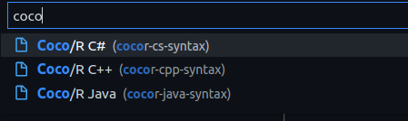
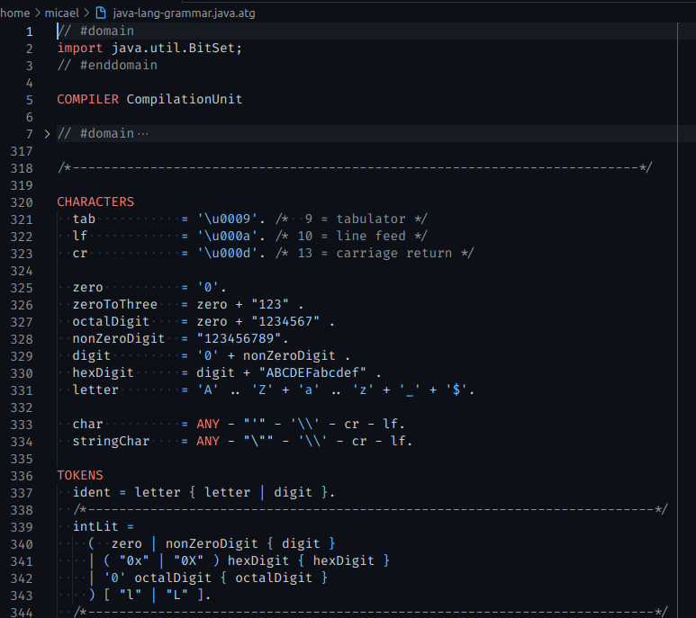
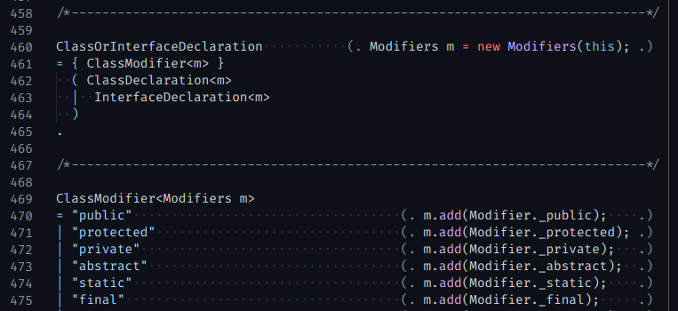

# Coco/R Syntax Highlighting - VS Code

The Compile Generator [Coco/R](https://ssw.jku.at/Research/Projects/Coco) syntax highlighting package for Visual Studio Code editor for Java, C# and C++ ports.

- Your file should end with `.java.atg` if you want to use the Java syntax highlighting
- Your file should end with `.cs.atg` if you want to use the C# syntax highlighting
- Your file should end with `.cpp.atg` if you want to use the C++ syntax highlighting
- Wrap the domain port code there was written in your ATG file between the `//#domain` and `//#enddomain` lines

The language files were taken from [mschoebel' Coco/R syntax highlighter plugin](https://github.com/mschoebel/cocosyntax) for Sublime Text.

## Preview








## Development

1. Clone the repository - `git clone https://github.com/micalevisk/cocosyntax-vscode`
2. `npm install`
3. Open it in VSCode
4. Go to the debugging section and run the laungh program "Launch Extension"
5. This will open another VSCode window with the extension enabled
6. Create a new file with a file name suffix matching your language (eg: `.java.atg`)
7. Verify that syntax highlight works and that the language configuration settings are working
8. Make changes to `syntaxes/*` file and reload the VSC window to load the changes

---

## Copyright Notes

```
Copyright (c) 2012, Michael Schoebel
All rights reserved for the TextMate grammars.
```
